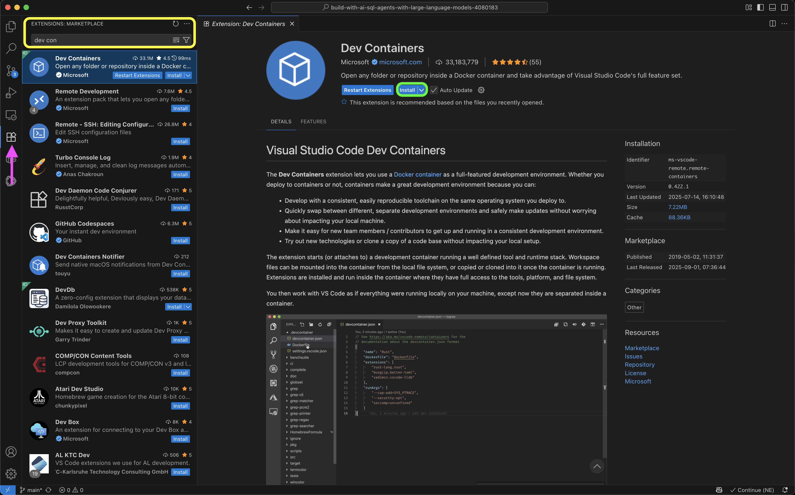

# Build with AI: SQL Agents with Large Language Models 

Rami Krispin

## SQL Agent Prerequisites: Python, SQL, and LLM Fundamentals Required

To complete this course successfuly, you will need knowledge of the following:
- Basic Python programming:
  - Functions and statements
  - Working with libraries and modules
  - DataFrame objects
  - Set and activate virtual environment
- Basic SQL knowledge
- Basic understanding of what Large Language Models are, and their capabilities.

## Python Environment Setup for SQL AI Agents: Complete Installation Guide

Setting a Python environment is crucial for running the code in this course. This section focuses on two approaches setting virtual environment:
- Locally with UV
- Using containerized environments (Docker) with the VSCode's Dev Containers extension

If you wish to use different approach for setting up the virtual environment, you can find the required libraries and their versions are listed in the `requirements.txt` file under the `docker` folder:

`./docker/requirements.txt`
```
pandas==2.3.1
numpy==2.3.2
plotly==6.2.0
plotly-express==0.4.1
ollama==0.5.3
ipywidgets==8.1.7
jupyter==1.1.1
duckdb==1.3.2
openai==1.99.5 
pointblank==0.12.0
google-genai==1.29.0
anthropic==0.63.0
```

### Setting up a virtual environment with UV

UV is a new Python package and project manager that is extremely fast. If you don't have UV installed, go to the [UV project documentation](https://docs.astral.sh/uv/getting-started/installation/) and follow the installation guide based on your operating system.

>Note that using UV is not a requirement to set up the virtual environment; it is just super fast. If you wish, you can simply use pip instead.

Let's start by setting up a the virtual environment with the uv venv command:

```
uv venv sql-ai-venv --python 3.11
```

In this case, we named the virtual enviroment as sql-ai-venv and set the Python version to 3.11.

Next, let's activate the virtual environment:
```
source sql-agent-venv/bin/activate
```

Last but not least, let's install the required libraries using the `requirements.txt` file under the `docker` folder:

```
uv pip install --no-cache-dir -r ./docker/requirements.txt
```

You can verify that all the packages were installed by using the following command:
```
uv pip list 
```

Or filter for specific library with the `grep` command:
```
uv pip list | grep openai
```

This should return the following output:

```
Using Python 3.11.12 environment at: sql-ai-venv
openai                    1.99.5
```

### Setting up a virtual environment with Docker, VSCode, and the Dev Containers extension

In this section, we will walk through the process of setting up the course environment inside a container using Docker and the Dev Containers extension in Visual Studio Code (VS Code).


####  Prerequisites

To launch the course repository inside a container, you will need the following:
- Visual Studio Code (VS Code)
- Docker Desktop
- Docker Hub account
- Dev Containers extension for VS Code


#### Installing Visual Studio Code
- Visit the Visual Studio Code website
- Click the Download button (highlighted in purple in the screenshot).
- Follow the installation instructions for your operating system.

<br>
<figure>
 </a>
<figcaption> The OpenAI API Python SDK workflow </figcaption>
</figure>

<br>


#### Installing the Dev Containers Extension

- In VS Code, click the Extensions icon on the left sidebar (purple arrow in the screenshot).
- In the search bar, type Dev Containers (yellow rectangle).
- From the search results, select the extension and review the details.
- Click Install (green rectangle).

<br>
<figure>
 </a>
<figcaption> Installing the Dev Containers Extension </figcaption>
</figure>

<br>

#### Installing Docker Desktop
- Visit the Docker website
- Download the appropriate installer for your operating system.
- Follow the installation steps.

<br>
<figure>
 </a>
<figcaption> Installing Docker Desktop </figcaption>
</figure>

<br>

> Note: Docker Desktop is free for personal use but requires a license for commercial use. For further information, please refer to https://www.docker.com/pricing/.


#### Creating a Docker Hub Account
To pull the course image, you will need a Docker Hub account.
- Go to the [Docker Hub website](https://hub.docker.com/)
- Click Sign Up and follow the instructions to create your account.


