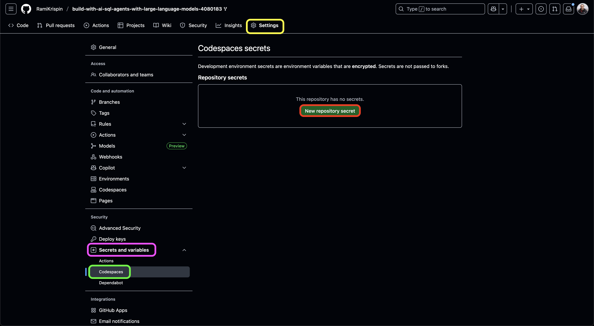
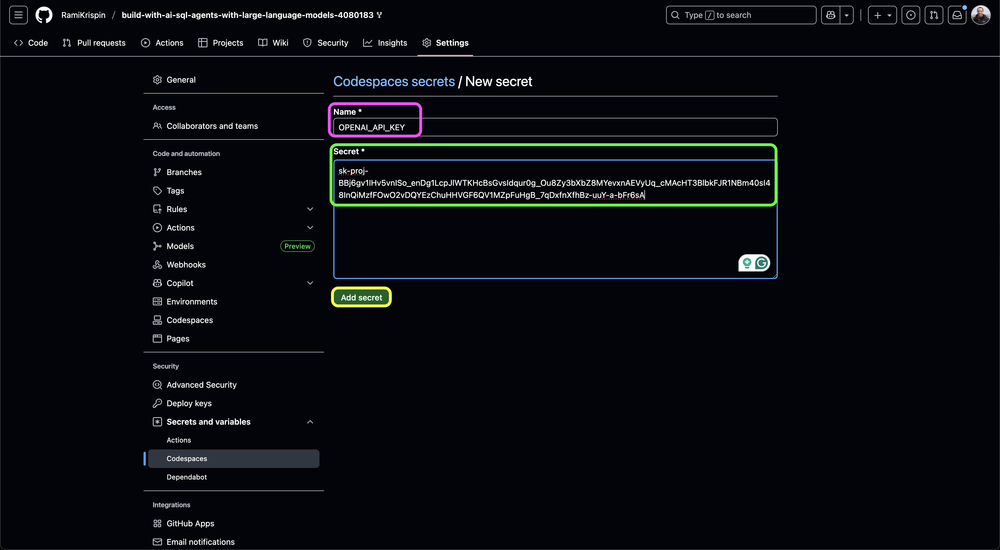
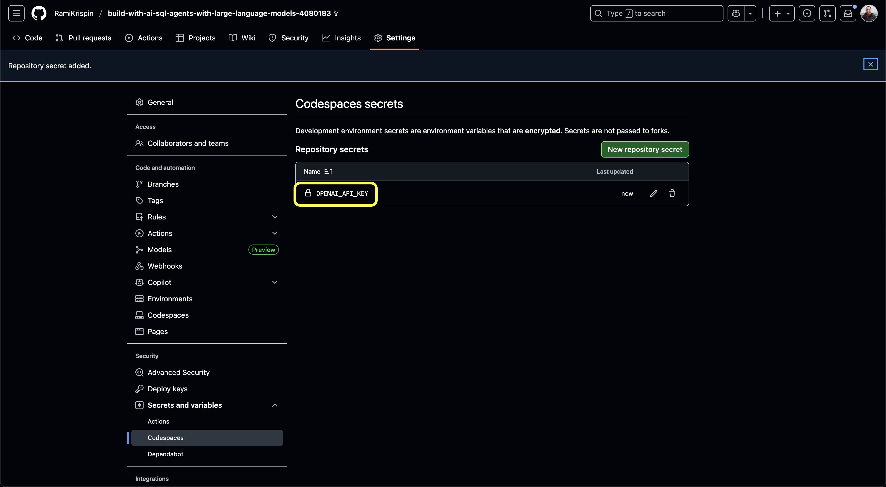
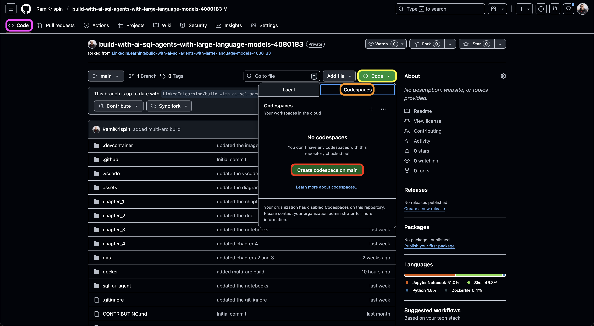
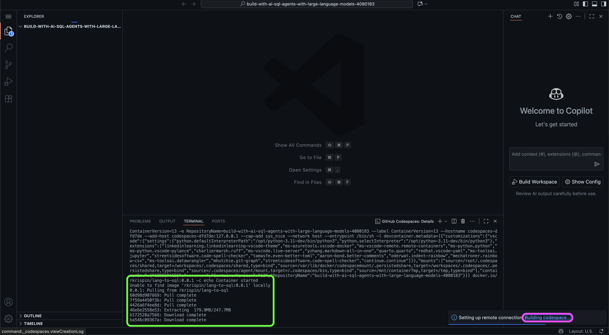
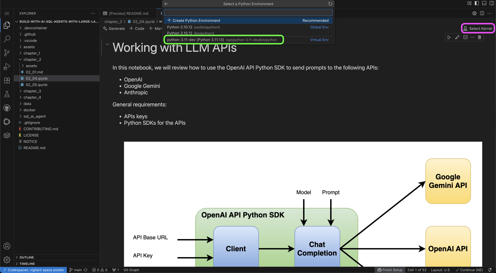
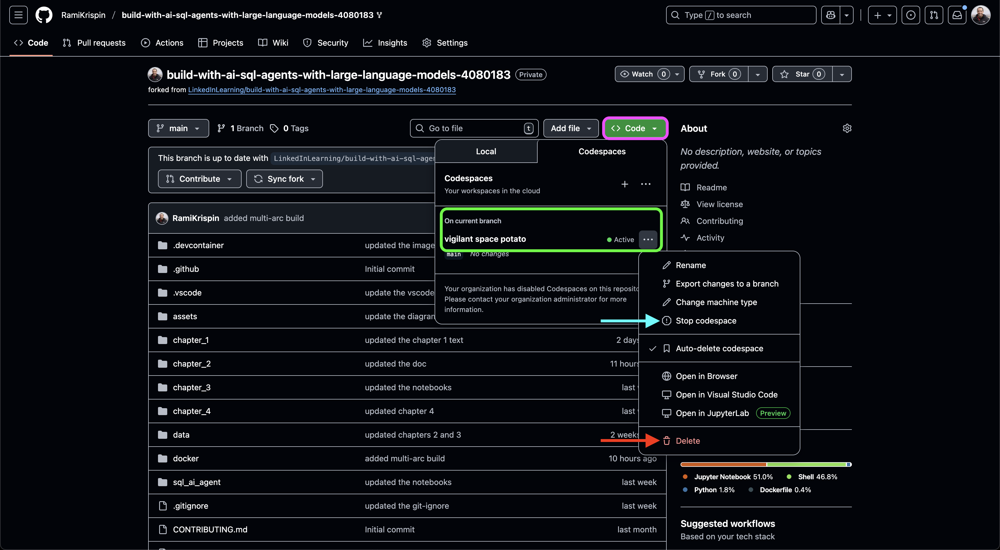

# Build with AI: SQL Agents with Large Language Models 

Rami Krispin

## Codespaces explainer

GitHub Codespaces enables you to open a GitHub repository inside VSCode, running directly in your browser on a GitHub-hosted virtual machine.

This guide provides step-by-step instructions for setting up and running the course repository inside GitHub Codespaces. By default, it launches VSCode with the course configuration inside a container defined by the Dev Containers config file: `.devcontainer/devcontainer.json`. 

> ⚠️ Important: GitHub Codespaces does not support running LLMs locally with Docker Model Runner.

## Prerequisites
- Fork the course repository (or clone it locally and push it to your own GitHub account).

## Setting

### Step 1: Setting API Keys as Secrets

Throughout the course, we will use the following LLM APIs:
- OpenAI
- Google Gemini
- Anthropic Claude

GitHub lets you securely store API keys as secrets, which can be accessed by your Codespace during runtime.

To add API keys as secrets in your repository:

- Open the `Settings` tab of your repository (marked in yellow).
- Select `Secrets and variables` in the left-hand menu (purple).
- Choose the `Codespaces` submenu (green).
- Click the `New repository secret` button (red).

 
<figure>
 </a>
<figcaption> Setting API Keys as Secrets </figcaption>
</figure>

 

Next:
- Enter a name for your secret (purple).
- Paste the API key in the value field (green).
- Click `Add secret` (yellow).

 
<figure>
 </a>
<figcaption> Setting API Keys as Secrets </figcaption>
</figure>

 

When complete, you should see your secret listed (yellow):

 
<figure>
 </a>
<figcaption> Setting API Keys as Secrets </figcaption>
</figure>

 

Repeat the same steps to add additional secrets.

## Step 2: Launch the Repository Inside GitHub Codespaces

Once your API keys are set as Codespaces secrets, you are ready to launch the repository:
- Go to the `Code` tab (purple).
- Click the green `Code` button (yellow).
- Select the `Codespaces` tab (orange).
- Click `Create codespace on main`.

 
<figure>
 </a>
<figcaption> Launch the Repository Inside GitHub Codespaces </figcaption>
</figure>

 

This will open a VSCode instance in your browser.
- The first launch may take several minutes while the course image is pulled from Docker Hub.
- You can track progress by clicking the `Building codespace…` link (purple).
- This will open the terminal (green), where you can see the image download progress.

 
<figure>
 </a>
<figcaption> Launch the Repository Inside GitHub Codespaces </figcaption>
</figure>

 

Once the Codespace is ready, you can start working with the repository.

👉 If you’re using Jupyter notebooks, make sure to select the correct virtual environment:
- Click `Select Kernel` (purple).
- Choose `python-3.11-dev` Python virtual environment (green).

 
<figure>
 </a>
<figcaption> Launch the Repository Inside GitHub Codespaces </figcaption>
</figure>

 

## Step 3: Stop or Delete a Codespace

When you finish working, don’t forget to stop or delete your Codespace to free up resources.

To do this:
- Go to the `Code` tab.
- Click the green `Code` button (purple).
- Under the `Codespaces` tab, you’ll see all active sessions (green).
- Click the … menu next to the active instance.
- Select `Stop codespace` (light blue arrow) or `Delete` (red arrow).

 
<figure>
 </a>
<figcaption> Stop or Delete a Codespace </figcaption>
</figure>

 
