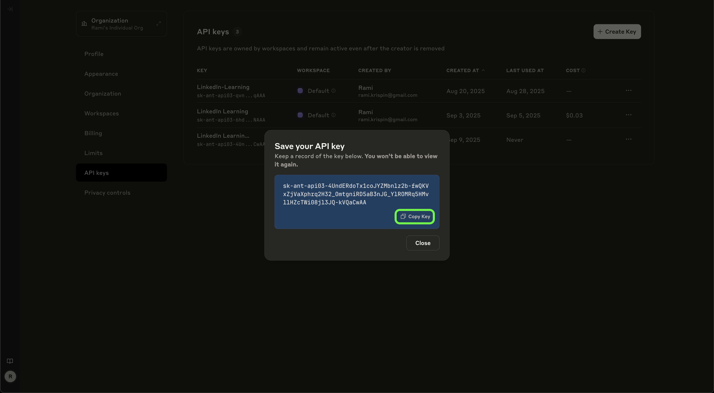

# Build with AI: SQL Agents with Large Language Models 

Rami Krispin

## API Key Setup Guide: OpenAI, Google Gemini, and Anthropic Authentication

Throughout the course, we will review how to use different LLMs via their APIs. In this document, we will review how to set up API keys for authenticating with the following large language model (LLM) APIs:
- OpenAI
- Google Gemini
- Anthropic Claude

> ⚠️ Important: the there APIs provider are a paid service. The Google Gemini API has a free tier with limited usage. Please check the APIs documentation for more information.

### Setting up an OpenAI API Key

To create an API key for OpenAI API:

- Go to the [OpenAI API website](https://openai.com/api/) and log in with your credentials.
- Click the Settings button in the top-right corner (green in the screenshot).
- From the left-hand menu, select API Keys (yellow).
- Click `+ Create new secret key` (purple).

 
<figure>
 </a>
<figcaption> The OpenAI API Platform Website </figcaption>
</figure>

 

Next, configure your new key:
- (Optional) Add a name, e.g., `LinkedIn Learning - SQL AI Agent` (purple).
- Select the project the key belongs to (green).
- Click Create secret key (yellow).

 
<figure>
 </a>
<figcaption> The OpenAI API Platform Website </figcaption>
</figure>

 

Finally, your new API key will be displayed:
- Copy the key using the copy button (yellow).
- Save it in a secure location (e.g., password manager or environment variables file).

 
<figure>
 </a>
<figcaption> The OpenAI API Platform Website </figcaption>
</figure>

 

> ⚠️ Important: After closing this window, you cannot view the key again. If you lose it, delete the old key from the API Keys menu and create a new one.

### Setting up a Google Gemini API Key

To create an API key for Google Gemini API:

- Go to the [Google AI Studio website](https://aistudio.google.com/app/apikey) and log in with your credentials.
- Select the API keys on the left menu (yellow in the screenshot).
- Click `+ Create API key` (purple).

 
<figure>
 </a>
<figcaption> The Google AI Studio website  </figcaption>
</figure>

 

Next, configure your new key:
- Select the project the key belongs to (yellow).
- Click on the `Create API key in existing project` button (yellow).

 
<figure>
 </a>
<figcaption> The Google AI Studio website </figcaption>
</figure>

 

Finally, your new API key will be displayed:
- Copy the key using the copy button (purple).
- Save it in a secure location (e.g., password manager or environment variables file).

 
<figure>
 </a>
<figcaption> The Google AI Studio website </figcaption>
</figure>

 

> ⚠️ Important: After closing this window, you cannot view the key again. If you lose it, delete the old key from the API Keys menu and create a new one.

### Setting up an Anthropic API Key

To create an API key for Anthropic API:

- Go to the [Anthropic user dashboard](https://console.anthropic.com/dashboard) and log in with your credentials.
- Click on the `Get API key` (purple).

 
<figure>
 </a>
<figcaption> The Anthropic website </figcaption>
</figure>

 

Next, click on the `Create key` button (purple).
 
<figure>
 </a>
<figcaption> The Anthropic website </figcaption>
</figure>

 

Next, configure your new key:
- Select the workspace (purple).
- Select the API key name, e.g.,  `LinkedIn Learning - SQL AI Agent` (yellow).
- Click on the `Add` button (yellow).

 
<figure>
 </a>
<figcaption> The Anthropic website </figcaption>
</figure>

 

Finally, your new API key will be displayed:
- Copy the key using the copy button (green).
- Save it in a secure location (e.g., password manager or environment variables file).

 
<figure>
 </a>
<figcaption> The Anthropic website </figcaption>
</figure>

 

> ⚠️ Important: After closing this window, you cannot view the key again. If you lose it, delete the old key from the API Keys menu and create a new one.